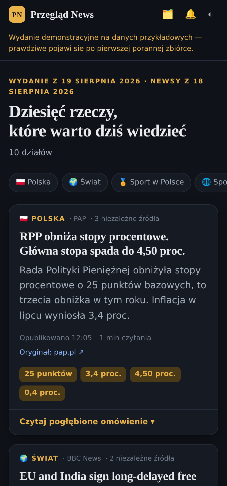
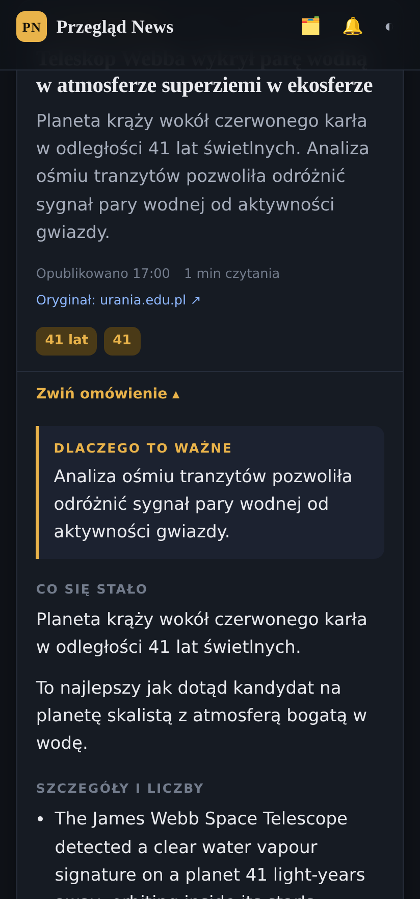

# Przegląd News

Codzienny, pogłębiony przegląd świata: **po jednej najważniejszej informacji z dziesięciu dziedzin**,
zebranej rano z newsów dnia poprzedniego, z nagłówkiem, działem i omówieniem, które faktycznie
czegoś uczy — a nie tylko donosi, że coś się wydarzyło.

| | |
|---|---|
|  |  |

## Dziesięć działów

🇵🇱 Polska · 🌍 Świat · 🏅 Sport w Polsce · 🌐 Sport na świecie · 🧪 Technologia i nauka ·
⚛️ Fizyka · 🔭 Astronomia · 🗺️ Geografia · 📚 Literatura · 🎬 Popkultura

W każdym dziale dokładnie jeden temat dnia — ten, który tego dnia opisało najwięcej niezależnych redakcji.

## Jak to działa

```
80 kanałów RSS  →  filtr dnia X-1  →  grupowanie w tematy  →  ranking  →  pogłębienie  →  JSON  →  aplikacja
```

1. **Zbiórka.** O 8:00 czasu polskiego kolektor pobiera 80 kanałów RSS (polskich i zagranicznych)
   i zostawia tylko materiały opublikowane poprzedniego dnia.
2. **Grupowanie.** Wpisy opisujące to samo wydarzenie trafiają do jednego klastra. Podobieństwo liczone
   jest na rzadkich w danej puli tokenach plus n-gramach znakowych, więc „obniżyła" i „obniża" to nadal
   jeden temat. Ponad barierą językową łączą liczby i nazwy własne — „Webb / 41 light-years"
   spotyka się z „Webba / 41 lat świetlnych".
3. **Ranking.** Wygrywa temat z największą liczbą **niezależnych źródeł** — to najuczciwszy dostępny
   sygnał ważności. Dalej liczą się ranga redakcji, miejsce w kanale, słowa kluczowe działu i świeżość.
   Punktacja każdego wybranego tematu ląduje w JSON-ie (pole `ranking`), więc zawsze widać, dlaczego coś wygrało.
4. **Pogłębienie.** Kolektor dociąga pełne teksty do czterech artykułów z różnych redakcji, dokłada tło
   z Wikipedii i składa omówienie: co się stało, szczegóły z liczbami, tło, jak piszą inni, źródła.
5. **Publikacja.** Wydanie ląduje jako JSON w `web/data/`, aplikacja je pokazuje, GitHub Pages serwuje całość.

### Dwa tryby omówień

| | bez klucza API | z `ANTHROPIC_API_KEY` |
|---|---|---|
| Skąd bierze się tekst | najlepsze zdania wybrane ze źródeł | Claude pisze omówienie na podstawie materiału |
| Język | jak w źródle (obce fragmenty z etykietą `[en]`) | zawsze polski, także dla źródeł angielskich |
| Zawiera | co się stało, liczby, tło z Wikipedii, inne spojrzenia | dodatkowo: dlaczego to ważne, kontekst, warto wiedzieć, słowniczek pojęć |
| Koszt | zero | ok. 5–10 groszy za wydanie |

Tryb bez klucza jest w pełni sprawny — klucz podnosi jakość, nie jest warunkiem działania.

## Szybki start

```bash
git clone https://github.com/olaf169-lang/Claude-mobile.git
cd claude-mobile
./przeglad.sh
```

Skrypt sam tworzy `.venv`, instaluje zależności, zbiera dzisiejsze wydanie i otwiera je na
`http://localhost:8080`.

```bash
./przeglad.sh --demo           # przykładowe wydanie z plików, bez internetu
./przeglad.sh --tylko-zbierz   # sam zbiór danych, bez serwera
./przeglad.sh --lekarz         # sprawdź, które kanały RSS jeszcze działają
```

Bezpośrednio:

```bash
python -m collector.build                        # dziś, z newsów z wczoraj
python -m collector.build --date 2026-08-19      # konkretne wydanie
python -m collector.build --only fizyka,kosmos   # wybrane działy
python -m collector.doctor --tylko-bledy         # kontrola źródeł
```

## Uruchomienie codzienne (GitHub Actions)

Workflow `.github/workflows/przeglad.yml` robi wszystko sam:

1. **Włącz GitHub Pages**: *Settings → Pages → Source: **GitHub Actions***.
2. **Zezwól Actions na zapis**: *Settings → Actions → General → Workflow permissions →
   Read and write permissions*.
3. *(opcjonalnie)* **Dodaj klucz**: *Settings → Secrets and variables → Actions → New repository secret*,
   nazwa `ANTHROPIC_API_KEY`. Bez niego wydania powstają w trybie ekstrakcyjnym.
4. Scal gałąź do `main` — **harmonogram działa tylko z domyślnej gałęzi**.

Przegląd pojawi się pod `https://olaf169-lang.github.io/Claude-mobile/`.

> **Repozytorium musi być publiczne** (albo konto na planie GitHub Pro) — Pages dla prywatnych
> repozytoriów to funkcja płatna. Zmiana: *Settings → General → Danger Zone → Change repository
> visibility → Public*. Publiczny robi się wtedy kod, nie żadne Twoje dane; klucz API zostaje
> w sekretach i nie jest widoczny.

> **Skąd dwa crony?** GitHub liczy harmonogram w UTC i nie zna polskiego czasu letniego. Workflow odpala
> się o 6:00 i 7:00 UTC, a krok kontrolny przepuszcza tylko ten przebieg, który trafia w polską ósmą
> i nie powiela już zbudowanego wydania. Dzięki temu wydanie wychodzi o 8:00 zimą i latem, a spóźnienie
> po stronie GitHuba (zdarza się) nie gubi dnia.

Ręczne uruchomienie: zakładka *Actions → Przegląd News — wydanie poranne → Run workflow*
(można podać własną datę).

## Aplikacja na telefon

### Wariant 1 — instalacja ze strony (najprostszy)

Otwórz przegląd w Chrome na Androidzie → menu ⋮ → **Zainstaluj aplikację**. Dostajesz ikonę na ekranie
głównym, pełny ekran bez paska przeglądarki, działanie offline i powiadomienia — bez sklepu Play.
Przycisk ⬇️ w aplikacji robi to samo, gdy Chrome go zaproponuje.

### Wariant 2 — APK

Zakładka *Actions → Aplikacja Android (APK) → Run workflow*. Po kilku minutach APK czeka
w artefaktach przebiegu (`przeglad-news-apk`). Przenieś na telefon i zainstaluj
(wymaga zgody „Instaluj nieznane aplikacje" dla menedżera plików).

APK to lekka otoczka: pokazuje opublikowany przegląd, dokłada odświeżanie gestem, obsługę przycisku
wstecz i — przede wszystkim — **WorkManager, który co trzy godziny sprawdza, czy jest nowe wydanie,
i wysyła powiadomienie z czołowym tematem**. Treść aktualizuje się sama, bez wypuszczania nowego APK.

Publikujesz gdzie indziej niż na GitHub Pages? Zmień `przegladUrl` w `android/gradle.properties`.

### Powiadomienia

| | jak działa |
|---|---|
| Aplikacja ze strony (PWA) | 🔔 w pasku górnym → zgoda na powiadomienia. Chrome na Androidzie sprawdza wydania w tle (Periodic Background Sync); przy każdym otwarciu aplikacja i tak porównuje datę wydania. |
| APK | zgoda przy pierwszym uruchomieniu; WorkManager pyta o nowe wydanie co ~3 godziny, niezależnie od tego, czy aplikacja jest otwarta. |

Powiadomienie pojawia się raz na wydanie — nie przy każdym sprawdzeniu.

## Konfiguracja

**Źródła i działy** — `collector/sources.py`. Jeden segment to nazwa, emoji, lista kanałów
(z wagą i językiem), słowa wzmacniające (`boost`) i blokujące (`block`). Dodanie działu to jeden wpis
w `SEGMENTS`; aplikacja podchwyci go bez zmian w kodzie.

```python
Segment(
    id="fizyka", name="Fizyka", emoji="⚛️",
    blurb="cząstki, materia, energia, kwanty",
    feeds=(_f("https://physics.aps.org/feed", "APS Physics", lang=EN, weight=1.3), ...),
    boost=("kwant", "quantum", "neutrino", ...),
    block=("horoscope", "astrology"),
    prefer_lang=EN,   # w którym języku ma być główny artykuł
)
```

**Inna godzina** — pole `cron` w `.github/workflows/przeglad.yml` (i próg godziny w kroku kontrolnym).

**Model** — zmienna `PRZEGLAD_MODEL` (domyślnie `claude-opus-5`).

**Kondycja źródeł** — serwisy zmieniają adresy kanałów bez uprzedzenia. `python -m collector.doctor`
mówi, który kanał nie odpowiada i który nie ma świeżych wpisów. Warto puścić raz na jakiś czas.

## Struktura

```
collector/          kolektor: źródła, pobieranie, ranking, pogłębianie, zapis
  sources.py        katalog 80 kanałów w 10 działach
  collect.py        pobieranie i normalizacja wpisów
  rank.py           grupowanie w tematy i wybór najważniejszego
  extract.py        wyciąganie treści artykułu ze strony
  wiki.py           tło encyklopedyczne
  llm.py            opcjonalne omówienie przez Claude
  compose.py        składanie gotowej informacji
  build.py          budowanie wydania (CLI)
  doctor.py         kontrola kondycji kanałów
web/                aplikacja (PWA): interfejs, service worker, dane wydań
android/            natywna otoczka z powiadomieniami w tle
tests/              testy offline na plikach z fixtures/
.github/workflows/  wydanie poranne, testy, budowa APK
```

## Testy

```bash
pip install -r requirements.txt -r requirements-dev.txt
pytest -q
```

35 testów, wszystkie offline — kanały czytane są z `tests/fixtures/`, żaden test nie dotyka sieci.
Pokrywają parsowanie kanałów, okno czasowe, filtry, grupowanie tematów (w tym łączenie polsko-angielskie
i *brak* łączenia różnych newsów o tym samym polityku), ekstrakcję treści i budowę całego wydania.

## Ograniczenia — warto wiedzieć

- **Wybór jest statystyczny, nie redakcyjny.** Kryterium „ile niezależnych redakcji o tym pisze" dobrze
  wyłapuje wydarzenia dnia, ale premiuje tematy głośne, nie zawsze najciekawsze. Wagi w `sources.py`
  i słowa `boost` to miejsce, w którym możesz to przechylić po swojemu.
- **Polski ma pierwszeństwo przed „ważnością".** Temat bez polskiego źródła przegrywa w rankingu
  z takim, który je ma, a omówienie składane jest wyłącznie z materiału w języku artykułu głównego.
  Czasem oznacza to, że najgłośniejsza światowa historia dnia ustąpi miejsca nieco mniejszej, za to
  opisanej po polsku. Gdy w dziale nie ma żadnego polskiego źródła, karta dostaje etykietę
  „po angielsku" zamiast po cichu mieszać języki. Klucz `ANTHROPIC_API_KEY` znosi ten kompromis:
  model pisze po polsku także z materiału angielskiego, więc wybór wraca do samej ważności tematu.
- **Kanały RSS się psują.** Katalog źródeł na pewno z czasem podniszczeje — stąd `collector.doctor`.
  Martwy kanał nie psuje wydania, jest tylko liczony w statystykach.
- **Wydanie nie może być pełniejsze niż źródła.** Jeśli w niedzielę nikt nie pisał o geografii,
  dział zostanie pusty i trafi na listę `braki`.
