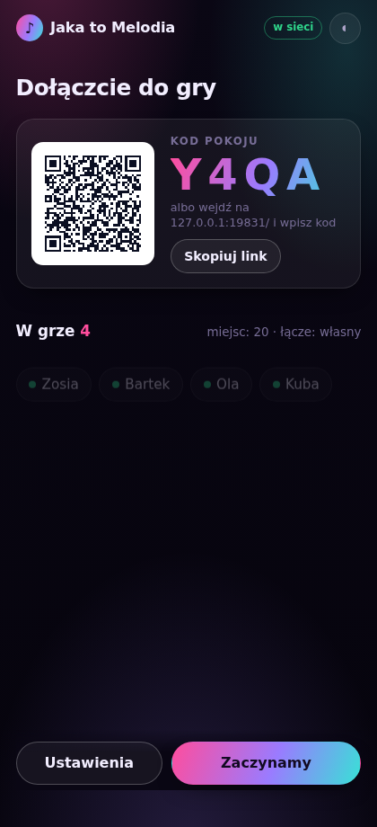
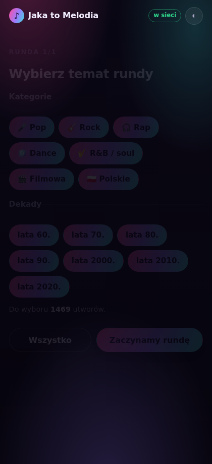
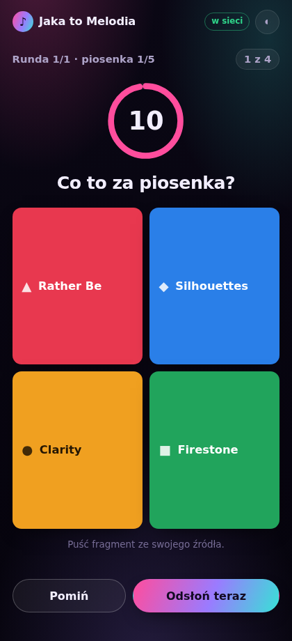
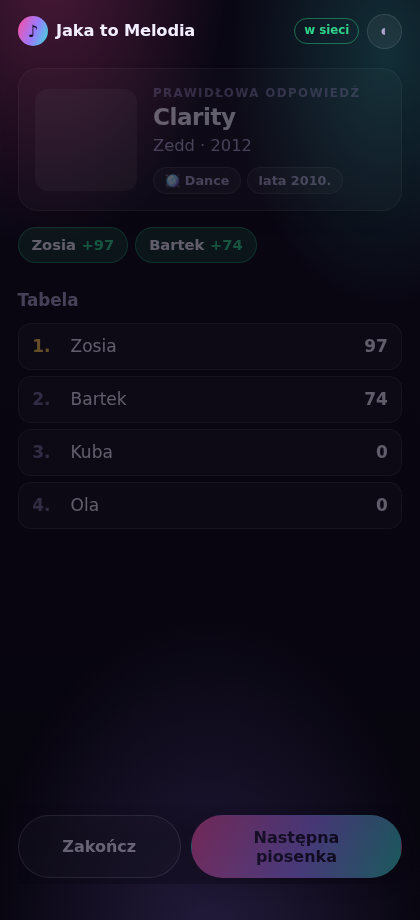
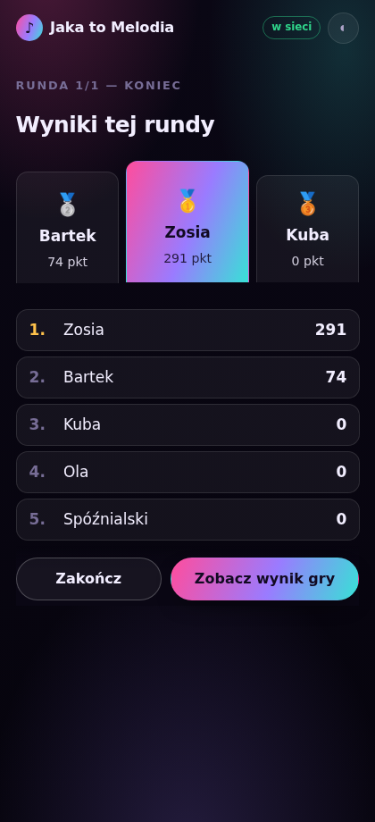
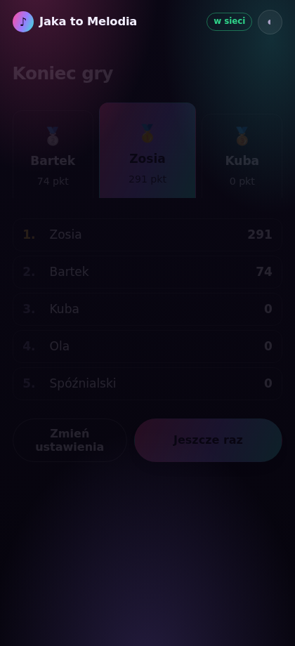

# Jaka to Melodia

Muzyczny quiz na wieczór. Jeden telefon prowadzi i puszcza trzydziestosekundowe
fragmenty, reszta zgaduje ze swoich — kto szybciej kliknie, ten ma więcej punktów.
Bez instalowania czegokolwiek: goście skanują kod QR i już grają.

**→ [olaf169-lang.github.io/Claude-mobile/jaka-to-melodia](https://olaf169-lang.github.io/Claude-mobile/jaka-to-melodia/)**

| | | |
|---|---|---|
|  |  |  |
| Lobby: kod QR i kto już jest | Temat rundy: kategorie i dekady | Runda: zegar i cztery odpowiedzi |
|  |  |  |
| Odsłona: kto trafił i ile dostał | Koniec rundy: podium i tabela | Koniec gry: podium i tabela |

## Jak się gra

1. **Prowadzący** ustawia długość serii, liczbę rund i czas na odpowiedź, po czym
   otwiera pokój. Jego telefon warto podpiąć do głośnika — to z niego leci muzyka.
2. **Goście** skanują kod QR albo wchodzą na tę samą stronę i wpisują czteroznakowy
   kod pokoju oraz swoją ksywkę.
3. Na początku każdej rundy ktoś wybiera jej temat — kategorie i dekady (np. „rock
   i rap, lata 80. i 90.”) albo po prostu wszystko. Potem krótkie odliczanie 3-2-1.
4. Leci fragment, na telefonach pojawiają się cztery odpowiedzi. Zegar tyka.
5. Po czasie prowadzący pokazuje, co to było (razem z kategorią i dekadą), kto
   trafił i jak wygląda tabela — a utwór jeszcze chwilę gra w tle.
6. Gdy seria się skończy, wszyscy widzą podium i tabelę tej rundy — a potem albo
   kolejna runda z nowym tematem, albo, po ostatniej, podsumowanie całej gry.

Miejsca jest na **20 telefonów**, wygodnie gra się do czternastu. Każdy potrzebuje
internetu, ale niekoniecznie tego samego wi-fi — telefony spotykają się przez
publiczny broker w sieci, nie przez lokalną sieć.

### Serie, rundy i temat

Gra dzieli się na **rundy** (1, 3, 5, 8 albo 10 — wybór prowadzącego), a każda runda
to **seria** kolejnych piosenek (5 do 25, jak dawniej). Różnica jest w temacie: każda
runda ma swój własny wybór kategorii i dekad, więc jedna runda potrafi być czystym
rockiem z lat 80. i 90., a następna — wszystkim naraz.

Kto wybiera temat, zależy od ustawienia **Kto wybiera temat rundy**:

- **Losowy gracz** *(domyślnie)* — na początku rundy telefony losują jedną osobę
  (może to być też prowadzący, jeśli akurat gra). Tylko ona widzi panel wyboru,
  reszta czeka z podglądem, kto teraz decyduje.
- **Zawsze ja** — temat za każdym razem ustala prowadzący, ze swojego telefonu.

Zaznaczenie **Wszystko** jest jednym kliknięciem — nie trzeba klikać każdej
kategorii i dekady osobno. Jeśli wybrany temat okaże się zbyt wąski (za mało
utworów na całą serię), gra sama prosi o wybór jeszcze raz.

Po ostatniej piosence serii wszystkie telefony — prowadzącego i graczy — widzą
animowane podium i tabelę tej rundy, zanim gra przejdzie dalej.

### We dwoje, w pojedynkę i w tłumie

Domyślnie **prowadzący też gra**: na jego ekranie te same cztery kafelki są
klikalne, a punkty liczą mu się na dokładnie tych samych zasadach co reszcie
— czas od pokazania pytania, bez taryfy ulgowej. Dzięki temu do gry wystarczą
**dwie osoby**, a nawet jedna, jeśli chce sprawdzić samą siebie. Gdy wszyscy
odpowiedzą, runda odsłania się od razu, bez czekania do końca zegara.

Na większej imprezie warto to wyłączyć (*Ja też gram* w ustawieniach): telefon
prowadzącego leży wtedy przy głośniku i służy za tablicę, na którą wszyscy
patrzą, a gra się wyłącznie ze swoich.

Prowadzący nie ma przy tym przewagi — prawidłowa odpowiedź nie pojawia się
nigdzie przed odsłoną, także na jego ekranie.

## Punkty

Maksimum za pytanie to **100 punktów** i dostaje je tylko ten, kto klika
natychmiast. Im dłużej się zastanawiasz, tym mniej zostaje — na sam koniec
czasu trafiona odpowiedź jest warta **30**. Zła odpowiedź albo brak odpowiedzi
to zero. Szybkość naprawdę się liczy.

```
punkty = 100 × (1 − 0,7 × czas / limit)
```

Czas mierzy telefon gracza, od chwili gdy pytanie faktycznie pojawi się na jego
ekranie. Wolniejsze łącze nie zabiera więc punktów.

Opcjonalny **bonus za serię** dokłada +10 za każde kolejne trafienie z rzędu,
maksymalnie +50.

## Skąd bierze się muzyka

Z trzydziestosekundowych fragmentów, które sklepy muzyczne udostępniają publicznie
do przesłuchania — w pierwszej kolejności **iTunes Search API**, a gdy tam czegoś
nie ma, **Deezer**. Żaden z nich nie wymaga konta ani klucza.

Adresy nagrań nie są szukane w trakcie imprezy. Raz w miesiącu (i po każdej zmianie
katalogu) workflow `jaka-to-melodia.yml` przechodzi cały katalog na serwerze GitHuba,
dopasowuje utwory i zapisuje wynik w `dane/podglady.json`. Aplikacja tylko go czyta,
więc runda rusza od razu. Wyszukiwanie w locie zostało jako zapas dla utworów
dopisanych po ostatnim przebiegu.

Wyszukiwarka iTunes przepuszcza około **dwudziestu zapytań na minutę z jednego
adresu** i nie da się tego obejść ponawianiem — trzeba pytać wolniej. Skrypt ma
więc bramkę pilnującą stałego odstępu, a workflow dzieli katalog na pięć części
i puszcza je równolegle na osobnych maszynach: pięć adresów, pięć limitów, całość
poniżej dziesięciu minut zamiast godziny. Potem `narzedzia/scal-podglady.mjs`
składa części z powrotem w jeden plik.

Dopasowanie nie jest naiwne: zapytanie „Queen Radio Ga Ga” zwraca też karaoke,
składanki coverów i wersje koncertowe. `js/dopasowanie.js` odrzuca podejrzane
dopiski, wymaga zgodnego wykonawcy i premiuje nagranie z roku wydania singla.

**Wolisz puszczać swoje?** Wyłącz „Muzykę z aplikacji” w ustawieniach. Gra pokazuje
wtedy tylko pytanie, zegar i odpowiedzi, a za dźwięk odpowiada prowadzący.

## Katalog

1469 utworów w siedmiu kategoriach i siedmiu dekadach:

| dekada | Pop | Rock | Rap | Dance | R&B / soul | Filmowa | Polskie |
|---|---:|---:|---:|---:|---:|---:|---:|
| lata 60. | 47 | 34 | — | — | 43 | 30 | 26 |
| lata 70. | 35 | 35 | — | 30 | 30 | 24 | 26 |
| lata 80. | 38 | 42 | 26 | 40 | 29 | 32 | 49 |
| lata 90. | 32 | 44 | 35 | 42 | 24 | 23 | 53 |
| lata 2000. | 36 | 45 | 36 | 35 | 30 | 12 | 44 |
| lata 2010. | 39 | 32 | 37 | 37 | 23 | 22 | 27 |
| lata 2020. | 35 | 16 | 25 | 19 | 17 | 15 | 18 |

„Polskie” to osobna kategoria, bez dzielenia na gatunki — pozostałe sześć obejmuje
kawałki anglojęzyczne. Każdy polski wpis ma jednak w tle pole `styl`, dzięki
któremu do polskiego rocka nie podstawi się disco polo.

Trzy pola w tabeli są celowo puste: w latach 60. rap i dance jeszcze nie istniały,
w 70. — rap. Taki gatunek po prostu nie da się wybrać dla tej dekady w ustawieniach
(`js/katalog.js` → `NIEISTNIEJACE`), a odzyskane miejsce poszło na inne kategorie
z tych lat, żeby dekady jako całość nie wypadały ubogo.

### Dopisanie piosenki

Jedna linijka w [`dane/utwory.js`](dane/utwory.js), w sekcji właściwej dekady
i kategorii:

```js
{ tytul: 'Mój dom', wykonawca: 'Kortez', rok: 2015, gatunek: 'polskie', styl: 'pop' },
```

Potem `node narzedzia/sprawdz-dane.mjs` (wyłapie duble i literówki w polach), a przy
najbliższym pushu workflow sam znajdzie nagranie. Utwór, do którego nagrania nie ma,
po prostu nie wejdzie do losowania — nazwa trafi na listę braków w podsumowaniu
przebiegu, więc od razu widać, co poprawić.

### Skąd biorą się złe odpowiedzi

Nie z losowania po całym katalogu. Kandydaci są punktowani za podobieństwo do
poprawnej odpowiedzi: inny kawałek tego samego wykonawcy, ta sama kategoria, ta sama
dekada, zbliżony rok. Do pytania trafiają najwyżej ocenieni. Przy pytaniu „kto
śpiewa” dodatkowo pilnujemy, żeby obok siebie nie stanęli „Taco Hemingway”
i „Dawid Podsiadło & Taco Hemingway”.

## Ustawienia

| | |
|---|---|
| **Ja też gram** | Prowadzący odpowiada na swoim telefonie. Wyłącz, gdy ma być tablicą przy głośniku. |
| **Kategorie i dekady** | Pula na całą grę — z niej wybiera się temat każdej rundy. Dowolne połączenie; licznik od razu pokazuje, ile utworów zostaje. |
| **Czas na odpowiedź** | 5, 7, 10, 15 albo 20 sekund. |
| **Długość serii** | Ile piosenek pod rząd w jednej rundzie: od 5 do 25. Jeśli pula tematu jest mniejsza, seria po prostu się skróci. |
| **Liczba rund** | Ile serii w tej grze: 1, 3, 5, 8 albo 10. |
| **Kto wybiera temat rundy** | Losowy gracz (domyślnie) albo zawsze prowadzący. |
| **O co pytamy** | O tytuł, o wykonawcę, albo raz o to, raz o to. |
| **Muzyka z aplikacji** | Wyłącz, jeśli puszczasz z własnego źródła. |
| **Losowy moment** | Fragment zaczyna się za każdym razem gdzie indziej — trudniej. |
| **Bonus za serię** | +10 za każde kolejne trafienie, do +50. |

Ustawienia zapamiętują się na telefonie prowadzącego.

## Jak to jest zrobione

Statyczna strona — HTML, CSS i moduły ES, bez budowania i bez frameworka. Wszystko
w [`js/`](js):

| plik | za co odpowiada |
|---|---|
| `katalog.js` | wspólne rozumienie utworu: identyfikator, dekada, porównywanie nazw |
| `gra.js` | silnik: losowanie rund, dobór złych odpowiedzi, punktacja, tabela |
| `mqtt.js` | mini-klient MQTT 3.1.1 po WebSocket (~200 linii zamiast biblioteki) |
| `siec.js` | pokój: kod, kod QR, protokół prowadzący ↔ gracze, wracanie po zerwaniu |
| `podglady.js` | skąd wziąć nagranie: plik z repozytorium, pamięć telefonu, sklep |
| `dopasowanie.js` | wybór właściwego nagrania spośród karaoke i wznowień |
| `odtwarzacz.js` | odtwarzanie z obejściami dla iOS-a, doczytywanie następnego utworu |
| `prowadzacy.js` / `gracz.js` | dwa tryby aplikacji, doczytywane dopiero po wyborze roli |

### Bez własnego serwera

Telefony rozmawiają przez publiczny broker MQTT (EMQX, w razie czego HiveMQ albo
Mosquitto) na dwóch tematach: `jtm/<KOD>/h` od prowadzącego i `jtm/<KOD>/g` od graczy.
Prowadzący jest jedynym źródłem prawdy — telefony niczego nie rozstrzygają.

Stan rundy jest nadawany co 1,2 sekundy, a nie raz. Dzięki temu telefon, który
dołączył w połowie albo na chwilę stracił zasięg, dostraja się sam. Poprawna
odpowiedź nie leci w eter przed odsłoną, więc nie da się jej podejrzeć
w podglądzie ruchu sieciowego.

Kod pokoju ma cztery znaki z alfabetu bez `O`, `0`, `I` i `1` — żeby dało się go
podyktować przez pokój.

### iPhone i Android

- Pierwsze odtworzenie musi wyjść z dotknięcia ekranu, więc przy „Zaczynamy”
  rozgrzewamy odtwarzacz ciszą. Kolejne rundy ruszają już same.
- Safari na iPhonie ignoruje ustawianie głośności z kodu — sprawdzamy to raz
  i tam, gdzie się nie da, po prostu nie wyciszamy płynnie.
- Ekran nie gaśnie w trakcie gry (Screen Wake Lock, gdzie jest dostępny).
- Dwa elementy `<audio>` na zmianę: jeden gra, drugi doczytuje następny utwór.
- Podwójne stuknięcie potrafi na iPhonie przybliżyć stronę zamiast trafić w kafelek
  — `maximum-scale=1, user-scalable=no` w viewporcie i `touch-action: manipulation`
  ustawione wprost na każdym klikalnym elemencie (nie tylko na `<body>`) usuwają ten
  gest i 300-milisekundowe opóźnienie przed kliknięciem, bo Safari samo potrafi
  zignorować regułę odziedziczoną tylko z rodzica.

### Testy

```bash
npm install          # aedes, ws, playwright — tylko do testów
npm test             # katalog, silnik, połączenie, dobieranie nagrań
npm run test:przegladarka   # pełna rozgrywka: prowadzący i pięć telefonów
```

Test przeglądarkowy stawia własny broker i własny serwer plików, po czym rozgrywa
dwie pełne gry przez cały cykl rund — wybór tematu, odliczanie 3-2-1, seria pytań
z odsłonami, wyniki rundy, koniec gry: imprezową (prowadzący plus cztery telefony,
od lobby do podium) i we dwoje (prowadzący w stawce plus jeden telefon, temat losuje
jedną z tych dwóch osób — sprawdzane są oba możliwe wyniki losowania). Sprawdza
między innymi, czy szybsza odpowiedź daje więcej punktów — także wtedy, gdy szybszy
jest prowadzący — czy telefon wchodzący w środku rundy dostaje resztę czasu, czy
poprawna odpowiedź nie pojawia się w eterze przed odsłoną i czy losowo wybrany
gracz rzeczywiście dostaje panel wyboru tematu, a reszta tylko czeka.

## Gdy coś nie działa

**„Nie ma takiego pokoju”** — prowadzący musi mieć otwarte lobby. Sprawdź też, czy
kod jest przepisany dokładnie; w kodach nie występują `O`, `0`, `I` ani `1`.

**Nikt nie może dołączyć** — w ustawieniach jest przycisk *Sprawdź połączenie*.
Pokaże, który z trzech brokerów odpowiada. Warto go kliknąć przed imprezą,
zwłaszcza w obcej sieci.

**Cisza zamiast muzyki** — na iPhonie zdarza się, gdy gra ruszyła bez dotknięcia
ekranu. Wyjdź do lobby i naciśnij „Zaczynamy” jeszcze raz. Jeśli konkretny utwór
nie chce zagrać, przycisk *Pomiń* wyrzuca go z tej gry.

**Sieć blokuje publiczne brokery** — można wskazać własny, dopisując do adresu
`?serwer=wss://twoj.broker/mqtt`. Parametr zostaje w linku do dołączenia, więc
wystarczy ustawić go raz, u prowadzącego.

## O prywatności

Broker jest publiczny i nieszyfrowany na poziomie treści: kto zna czteroznakowy kod
pokoju, może podejrzeć ruch. W eterze są tylko ksywki, pytania i punkty — nic, czego
nie widać na ekranie. Poprawna odpowiedź jedzie dopiero na odsłonie, więc nawet
podglądanie nie pomoże wygrać.

## Licencja

Kod aplikacji — jak reszta repozytorium. Generator kodów QR w `vendor/` pochodzi
z pakietu `qrcode-generator` (Kazuhiko Arase, MIT) i leży tam bez zmian; szczegóły
w [`vendor/CZYTAJ.md`](vendor/CZYTAJ.md).
