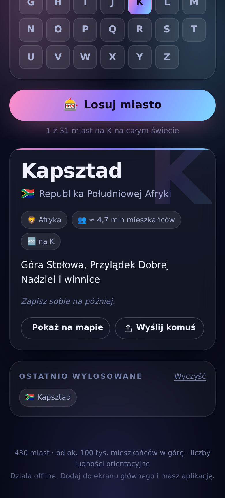

# Gacha Miast 🎰🌍

Losownik miast świata na zadaną literę. Wybierasz literę (albo zostawiasz kostkę),
wybierasz kontynent, klikasz jeden guzik — wypada miasto, do którego **naprawdę warto pojechać**.
Bez kont, bez instalatora, bez internetu po pierwszym otwarciu.

| | |
|---|---|
|  |  |

## Co losuje

**430 miast** z sześciu kontynentów — od Budapesztu i Brna po Kanton i Valparaíso.
Kryterium doboru jest jedno: ma być po co tam jechać.

- dolna granica to ok. **100 tys. mieszkańców** — chodzi o miasta, które mają czym zająć na weekend,
  a nie o przypadkowe kropki na mapie;
- każde miasto ma jedno zdanie mówiące, co się tam ogląda (to zdanie jest w danych, nie generuje się
  w locie — nic nie musi pytać sieci);
- **każda z 26 liter alfabetu ma co najmniej jedno miasto**, więc żaden przycisk w siatce nie jest martwy
  (nawet X i Q — Xi'an, Xiamen, Qingdao, Quito, Quebec, Querétaro);
- nazwy po polsku tam, gdzie polska nazwa jest w użyciu (Monachium, Lizbona, Erywań), oryginalne tam,
  gdzie polskiej nie ma;
- pierwsza litera liczy się bez ogonków: **Łódź trafia pod L**.

| kontynent | miast |
|---|---:|
| 🏰 Europa | 170 |
| ⛩️ Azja | 97 |
| 🗽 Ameryka Płn. | 59 |
| 🏔️ Ameryka Płd. | 45 |
| 🦁 Afryka | 39 |
| 🏄 Oceania | 20 |

Kontynenty można łączyć — zaznacz Europę i Azję naraz albo zostaw „Cały świat".

## Jak działa losowanie

Aplikacja **nie powtarza miast**, dopóki nie wyczerpie puli. Dla każdej kombinacji
(kontynenty + litera) pamięta, co już padło; kiedy pula się kończy, tasuje ją od nowa i mówi o tym.
Licznik pod guzikiem cały czas pokazuje, ile z ilu już znasz — *„7 z 34 miast na B w Europie"*.
Stan przeżywa zamknięcie aplikacji (`localStorage`).

Drobiazgi: spacja losuje, naciśnięcie litery na klawiaturze ją wybiera, telefon lekko wibruje przy
trafieniu, a przy każdym losowaniu sypią się płatki sakury — mały ukłon w stronę ekipy 🌸
(stąd też nazwa i katakana pod tytułem).

## Wysłanie znajomym — trzy sposoby

**1. Link (iOS i Android, najprostszy).** Wystarczy adres strony. Przycisk 📤 w pasku wysyła go
systemowym oknem udostępniania albo kopiuje do schowka. Po wklejeniu w komunikatorze pokazuje się
karta z podglądem (`icons/podglad.png`).

**2. Aplikacja na ekranie głównym (PWA).** Android/Chrome: menu ⋮ → *Zainstaluj aplikację*
(albo guzik ⬇️, gdy Chrome go zaproponuje). iPhone/Safari: *Udostępnij* → *Do ekranu głównego*.
Dostajesz ikonę, pełny ekran bez paska przeglądarki i działanie offline — bez App Store i bez Google Play.

**3. Jeden plik HTML (bez hostingu).** 

```bash
node narzedzia/jeden-plik.mjs      # → dist/gacha-miast.html
```

Cała aplikacja — style, dane, kod, ikony — ląduje w jednym pliku (~125 kB). Można go wysłać
WhatsAppem czy mailem i otworzyć wprost z telefonu, bez internetu i bez żadnego serwera.

## Uruchomienie u siebie

To zwykła strona statyczna — żadnej budowy, żadnych zależności:

```bash
cd miasta
python3 -m http.server 8080      # → http://localhost:8080
```

Sam plik `index.html` też otworzy się z dysku, ale service worker (offline) włącza się dopiero
po HTTP — do sprawdzenia trybu offline użyj serwera albo sklejki jednoplikowej.

## Publikacja na GitHub Pages

Workflow `.github/workflows/miasta.yml`:

- **przy każdym pushu** do `miasta/**` sprawdza katalog miast (`narzedzia/sprawdz-dane.mjs`);
- **publikuje tylko na żądanie** — *Actions → Gacha Miast — strona → Run workflow*.

Publikacja jest ręczna celowo: GitHub Pages serwuje **jedną stronę na repozytorium**, a pod tym
adresem stoi już Przegląd News. Ręczne uruchomienie to świadoma decyzja, co ma być pod adresem
`https://olaf169-lang.github.io/Claude-mobile/`, a nie efekt uboczny pushu.

Chcesz obie aplikacje naraz? Trzy opcje, od najprostszej:

1. wysyłaj kolegom **jeden plik** z `dist/` — nie potrzebuje w ogóle hostingu;
2. postaw Gacha Miast w **osobnym repozytorium** (wystarczy skopiować katalog `miasta/`);
3. albo dołóż katalog do artefaktu Przeglądu — wtedy aplikacja stanie pod `…/miasta/`.
   Adres w znacznikach `og:` w `index.html` trzeba wtedy podmienić, bo jest bezwzględny.

## Dopisanie miasta

Wszystko siedzi w `dane.js`, jeden wiersz to jedno miasto:

```js
['Budapeszt', 'Węgry', '🇭🇺', 'eu', 1750, 'Parlament nad Dunajem, łaźnie termalne i ruin-bary'],
//  nazwa       kraj    flaga  kontynent  ludność (tys.)  po co tam jechać
```

Kontynenty: `eu` `az` `af` `na` `sa` `oc`. Aplikacja sama policzy miasta, sama zaktualizuje liczniki
przy kontynentach i sama włączy przycisk litery — nic więcej nie trzeba ruszać.

Potem kontrola:

```bash
node narzedzia/sprawdz-dane.mjs
```

Sprawdza liczbę kolumn, nieznane kontynenty, duplikaty nazw, ludność poniżej progu, opisy za krótkie,
za długie (nie zmieszczą się na karcie) i kończące się kropką, a na koniec — czy **każda litera
alfabetu wciąż ma jakieś miasto** i czy żaden kontynent nie zrobił się za chudy na losowanie.
Ten sam skrypt chodzi w GitHub Actions.

## Struktura

```
miasta/
  index.html          szkielet ekranu
  styles.css          motyw ciemny i jasny na zmiennych CSS
  app.js              losowanie, pamięć puli, historia, udostępnianie
  dane.js             katalog 430 miast + lista kontynentów
  sw.js               service worker (offline)
  manifest.webmanifest
  icons/              ikony aplikacji i karta podglądu linku
  narzedzia/
    ikony.py          generator ikon (Pillow) — maskotka-globus
    sprawdz-dane.mjs  kontrola katalogu miast
    jeden-plik.mjs    sklejka do jednego pliku HTML
  docs/               zrzuty do README
```

Ikony przerysowuje się poleceniem `python3 narzedzia/ikony.py` (potrzebne `pillow`).

## Czego to nie robi

- **Nie zna cen ani lotów.** To losownik pomysłów, nie wyszukiwarka wycieczek.
- **Liczby ludności są orientacyjne** i zaokrąglone — raz miasto, raz aglomeracja. Służą skali
  („to metropolia czy miasteczko"), nie statystyce.
- **Lista jest subiektywna.** 430 miast to nie ranking, tylko dobór: miejsca, w których jest co
  oglądać. Brakuje Twojego? Jeden wiersz w `dane.js` i już go nie brakuje.
- **Nie ma miast, do których dziś się nie jeździ** — pominięte świadomie.
